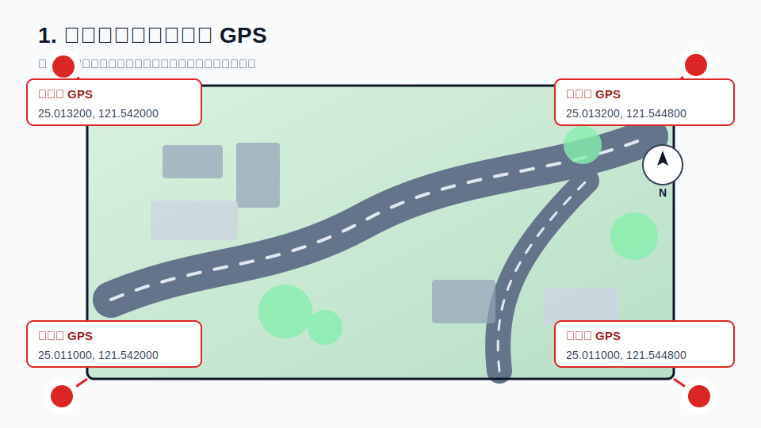
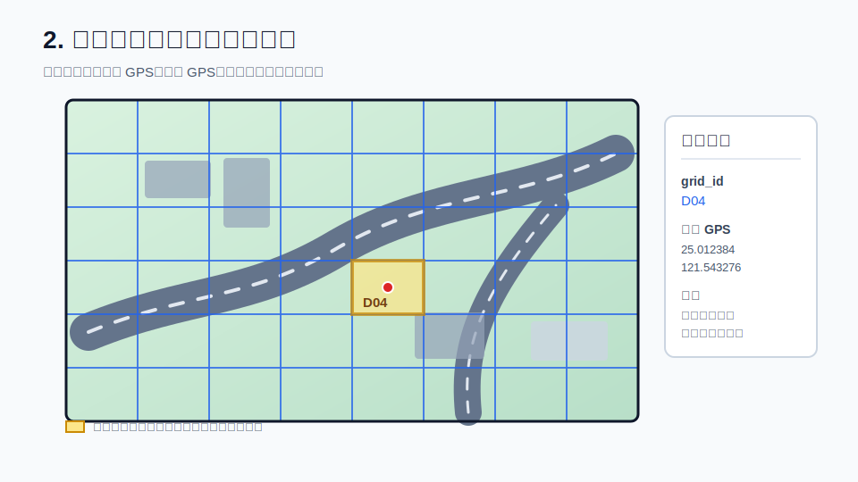
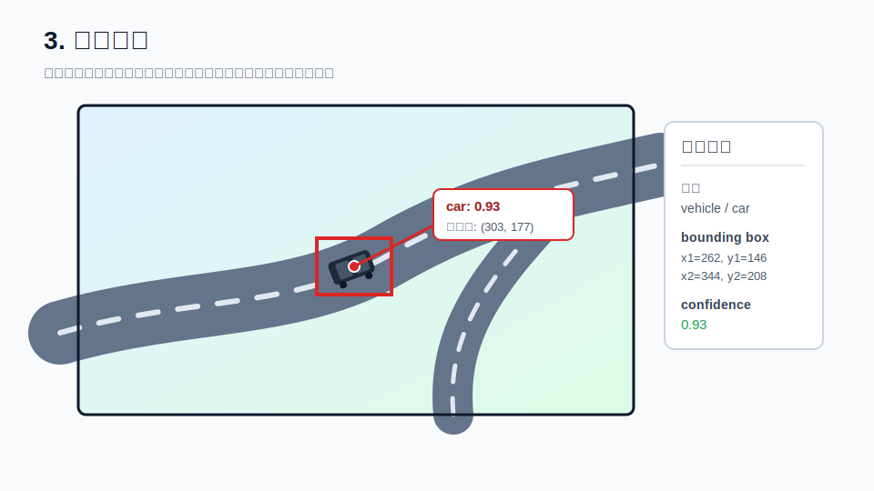
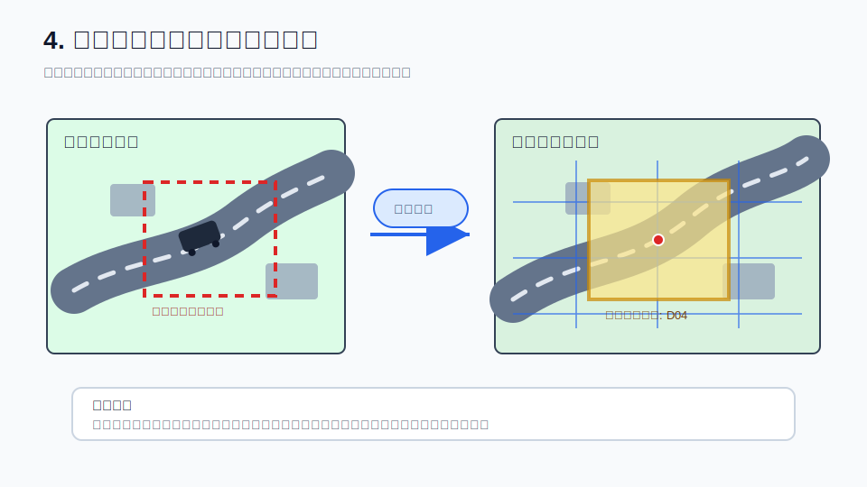
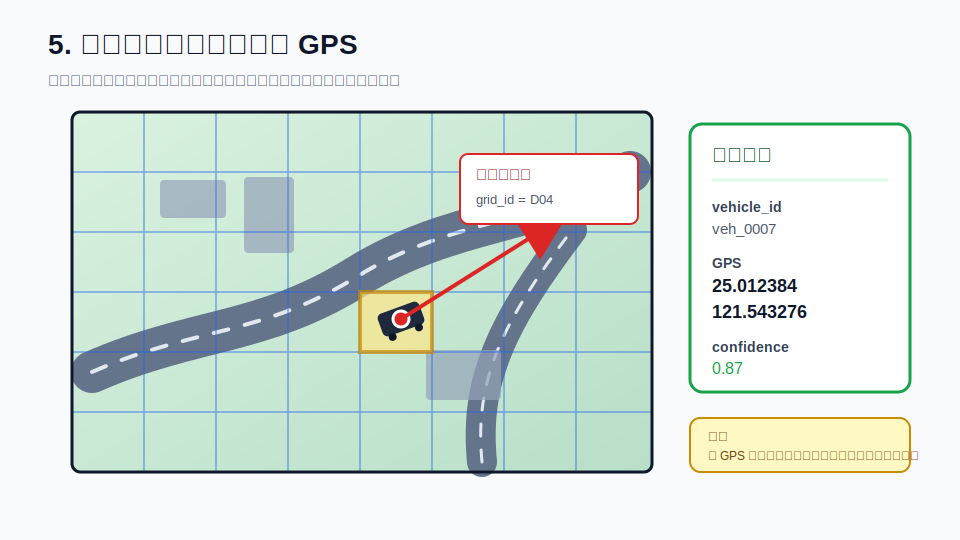
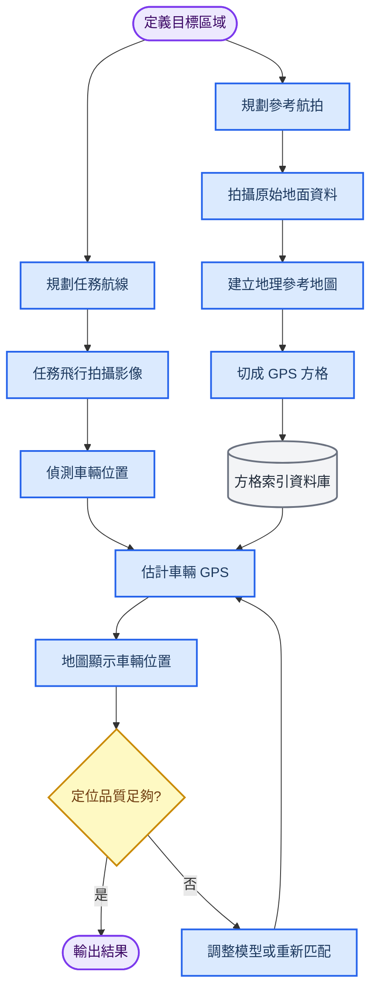
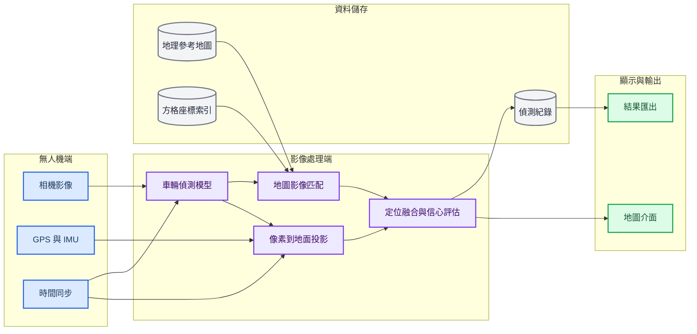
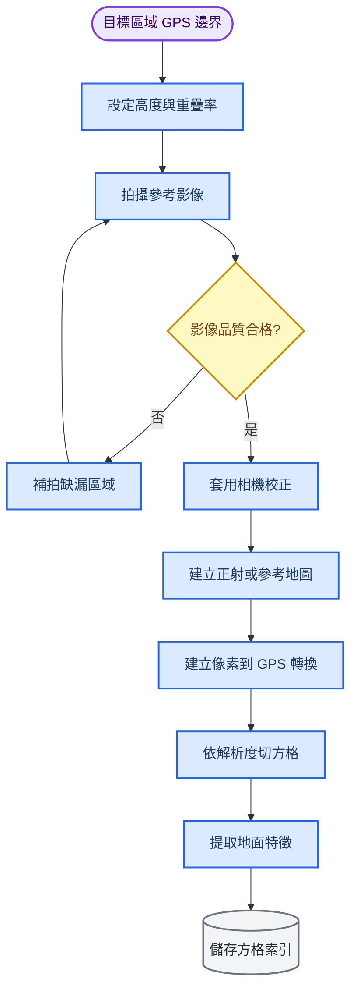
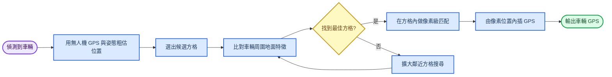
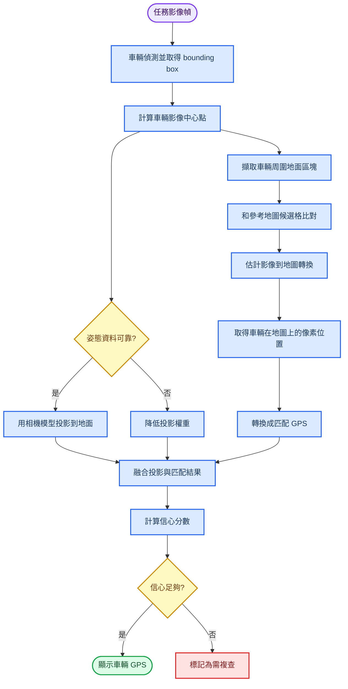

# 無人機地面車輛定位專案流程

_目標：讓無人機拍攝地面影像，辨識車輛，並顯示車輛對應的 GPS 位置。_

---

## 目標與已知條件

本專案的核心任務是把「影像中的車輛位置」轉換成「地圖上的 GPS 座標」。目前已知資訊是目標區域的範圍與 GPS 座標，因此建議先建立一份可查詢的參考地圖，再把每次無人機拍到的車輛影像投影或比對到這份地圖上。

| 類別 | 內容 |
| --- | --- |
| 已知輸入 | 目標區域邊界 GPS、無人機影像、無人機 GPS/IMU、相機參數 |
| 主要輸出 | 車輛 ID、車輛中心點 GPS、信心分數、所在方格 ID |
| 核心方法 | 地圖切格、車輛偵測、影像配準、像素座標轉 GPS |
| 重要假設 | 相機時間、無人機姿態、GPS/IMU 與影像幀需要同步 |

> 重要提醒：實作時不建議只拿「車子本體」和原始地圖比對，因為車輛會移動，參考地圖上不一定有同一台車。比較穩定的做法是使用車輛周圍的道路標線、路面紋理、建物邊緣、固定地物做匹配，再由車輛在影像中的相對位置推回 GPS。

## 全流程總覽

下圖把專案拆成兩條主線：先建立參考地圖與方格索引，再進行任務飛行、車輛偵測與座標估計。

_Figure 1: 原始地圖和四個角的 GPS，建立後續座標轉換基準。_

_Figure 2: 把原始地圖切成多個小框框，每格都有 GPS 範圍與中心點。_

_Figure 3: 模型偵測車輛，輸出 bounding box、中心點與信心分數。_

_Figure 4: 擷取車輛周圍環境，和原始地圖候選區做特徵比對。_

_Figure 5: 比對完成後，輸出車輛 GPS、方格 ID 與信心分數。_

## 系統架構

整體系統可以分成四層：無人機端、影像處理端、定位資料庫、以及前端地圖顯示。若需要即時顯示，可以把偵測模型放在邊緣運算設備；若任務允許離線分析，可以先存影像，再回地面站處理。

## 參考地圖建立流程

參考地圖是整個定位系統的基準。它需要把原始航拍影像整理成「每個像素都可以對應到 GPS 或地圖座標」的資料。若未來要提高準確度，可以加入地面控制點、相機校正、以及正射影像拼接。

## 方格座標索引設計

方格的用途不是直接取代定位演算法，而是讓系統可以快速縮小搜尋範圍。每一格都應該記錄地圖上的範圍、中心座標、影像特徵，以及鄰近方格。

| 欄位 | 說明 |
| --- | --- |
| `grid_id` | 方格唯一編號，例如 `A03_B12` |
| `gps_bbox` | 方格四角 GPS，包含西北、東北、西南、東南 |
| `gps_center` | 方格中心 GPS |
| `map_pixel_bbox` | 方格在參考地圖中的像素範圍 |
| `ground_resolution` | 每個像素代表的地面距離 |
| `visual_features` | 此格的影像特徵，用於快速比對 |
| `neighbor_grid_ids` | 上下左右與斜向鄰格 |

方格大小要依需求調整。若格子太大，定位只會得到粗略區域；若格子太小，影像匹配容易受角度、光照、遮蔽影響。實務上可以先用粗格搜尋，再在候選格附近做細部匹配。

## 車輛定位流程

任務飛行時，每張影像會先通過車輛偵測模型，得到車輛框。接著有兩種座標估計方法可以互相補強：第一種是根據無人機姿態和相機模型做幾何投影；第二種是把影像和參考地圖做配準。最後把兩者融合，給出 GPS 與信心分數。

## 建議演算法模組

| 模組 | 建議內容 | 目的 |
| --- | --- | --- |
| 車輛偵測 | YOLO 系列、RT-DETR、或其他 aerial-view object detector | 找出影像中的車輛框 |
| 影像配準 | ORB、SIFT、SuperPoint、LoFTR、或特徵匹配加 RANSAC | 把任務影像對齊到參考地圖 |
| 幾何投影 | 相機內參、外參、無人機高度、姿態角、地面平面假設 | 從影像像素推估地面座標 |
| 座標轉換 | 參考地圖 geo-transform、方格四角 GPS 內插 | 把地圖像素轉成 GPS |
| 信心評估 | 偵測分數、匹配分數、投影與匹配距離差 | 判斷結果是否可靠 |

建議先做離線版流程，確認定位誤差與失敗情境，再決定是否搬到即時系統。離線版可以更容易調參、檢查錯誤案例，也比較容易建立訓練資料。

## 資料輸出格式

每次偵測到車輛後，建議輸出結構化紀錄，方便後續做地圖顯示、軌跡追蹤與誤差分析。

| 欄位 | 範例 | 說明 |
| --- | --- | --- |
| `timestamp` | `2026-06-23T10:15:30Z` | 影像時間 |
| `frame_id` | `flight_001_frame_0234` | 影像幀編號 |
| `vehicle_id` | `veh_0007` | 車輛追蹤 ID |
| `bbox_xyxy` | `[530, 210, 590, 260]` | 車輛框座標 |
| `grid_id` | `A03_B12` | 最接近的地圖方格 |
| `latitude` | `25.012345` | 車輛緯度 |
| `longitude` | `121.543210` | 車輛經度 |
| `confidence` | `0.87` | 綜合信心分數 |
| `method` | `projection_match_fusion` | 使用的定位方法 |

## 評估與驗證

定位系統需要驗證的不只是「有沒有偵測到車」，還要驗證「GPS 是否足夠準」。建議用已知位置的車輛或人工標註點作為基準。

| 評估項目 | 量測方式 |
| --- | --- |
| 偵測準確度 | precision、recall、mAP |
| 定位誤差 | 預測 GPS 與真值 GPS 的距離誤差 |
| 方格命中率 | 預測方格是否包含真實車輛位置 |
| 匹配穩定度 | 不同高度、角度、光照下的匹配成功率 |
| 即時性 | 每張影像處理時間與端到端延遲 |

## 主要風險與對策

| 風險 | 影響 | 對策 |
| --- | --- | --- |
| 無人機 GPS 漂移 | 初始候選方格錯誤 | 使用影像匹配修正，並擴大候選格搜尋 |
| 相機姿態誤差 | 幾何投影偏移 | 做相機校正，融合影像配準結果 |
| 光照與陰影變化 | 地圖匹配失敗 | 使用特徵匹配與深度特徵，建立多時段參考資料 |
| 車輛遮蔽或太小 | 偵測漏失 | 調整飛行高度、提高解析度、補強訓練資料 |
| 地面高度不平 | 平面投影誤差 | 加入 DSM/DEM 或限制在近似平坦區域 |

## 建議開發里程碑

1. 建立目標區域邊界資料與基本航拍規劃
2. 拍攝參考影像並建立可查詢的地理參考地圖
3. 完成方格切分與 `grid_id` 到 GPS 的索引
4. 訓練或導入車輛偵測模型
5. 建立任務影像到參考地圖的匹配流程
6. 完成車輛像素位置到 GPS 的轉換
7. 建立地圖顯示介面與結果匯出格式
8. 用真值點驗證定位誤差並迭代改善

## 最小可行版本

第一版可以先把範圍縮小，避免一開始就做完整即時系統。

| 階段 | 必做功能 | 暫緩功能 |
| --- | --- | --- |
| MVP 1 | 離線航拍影像、人工建立參考圖、方格索引 | 即時串流 |
| MVP 2 | 車輛偵測、候選方格搜尋、粗略 GPS | 多車追蹤 |
| MVP 3 | 影像配準、像素級 GPS 內插、信心分數 | 完整自動飛行任務 |
| MVP 4 | 地圖顯示、結果匯出、誤差報告 | 邊緣端即時部署 |

這樣可以先驗證最關鍵的問題：在你的目標區域、飛行高度與相機解析度下，車輛 GPS 定位誤差是否能達到需求。
